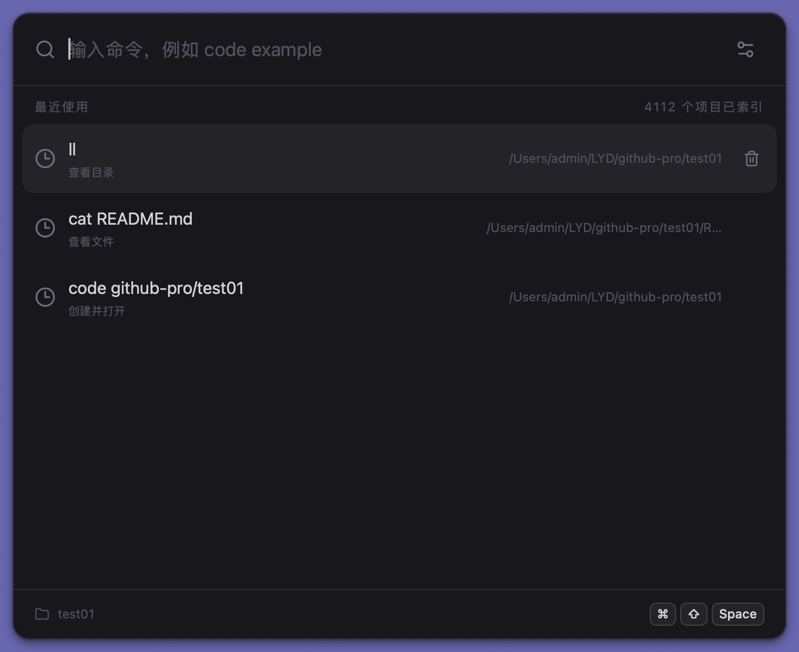

# Quick Command

A local project launcher for macOS. Open it with a global shortcut, then use short, predictable commands to find projects, inspect files, and continue in your preferred development tools.

[简体中文](README.md) · [Architecture](docs/ARCHITECTURE.md) · [Release guide](docs/RELEASE.md)

<p align="center">
  
</p>

## Why Quick Command

Opening a local project often means launching a terminal, navigating to the right directory, and entering an editor command. As the number of projects grows, remembering paths and repeating that navigation becomes an unnecessary interruption.

Quick Command puts this workflow into a lightweight, Spotlight-style window: press a global shortcut, enter a project name or a supported command, and get back to work. It focuses on frequent, local, verifiable development actions instead of recreating a full terminal in a desktop interface.

## Highlights

- **Instant access**: show or hide the launcher with a configurable global shortcut; it automatically hides when focus moves elsewhere.
- **Project search**: index multiple user-selected workspaces and rank local projects by match quality and usage frequency.
- **Development tool launchers**: open projects or files with structured arguments through `code`, `cursor`, `idea`, `webstorm`, `zed`, or `open`.
- **Workspace context**: choose from approved workspaces when a command needs a directory; use `cd` to change the application's active context.
- **Readable presentation**: browse directories and text files through native views for `ls`, `ll`, and `cat` instead of raw terminal output.
- **Safe directory operations**: preview and confirm `mkdir` or missing project directories before creation, always within a configured workspace.
- **History and preferences**: keep successful actions, promote frequently used projects, remove individual history items, and customize the shortcut.
- **Manual updates**: check for updates in Settings, review release notes, and install artifacts verified with a Tauri updater signature.

<p align="center">
  
</p>

<p align="center">
  <a href="captures/v0.2.0.display.mov">▶ Watch the Quick Command demo video</a>
</p>

## Installation

### Homebrew

Once the Quick Command Cask is available in the public tap, install it with:

```bash
brew install --cask LIUeng/tap/quick-command
```

The first Cask is generated after a public GitHub Release containing a DMG is published. If Homebrew cannot find the Cask yet, use the direct download option below.

### GitHub Releases

1. Open [GitHub Releases](https://github.com/LIUeng/quick-command/releases).
2. Download the latest macOS DMG.
3. Open the DMG and drag Quick Command into Applications.

Apple Developer ID signing and notarization are not enabled yet. If macOS blocks the first launch, open System Settings → Privacy & Security, verify the application source, and choose **Open Anyway**. You do not need—and should not attempt—to disable Gatekeeper globally.

## Basic usage

Add one or more workspaces in Settings, then open Quick Command with the global shortcut.

```text
code example
code x-pro/test01
ll
cat README.md
cd project
mkdir demo
```

- `code example` first searches indexed projects; when no target exists, you can choose the intended file action or confirm project-directory creation.
- `code x-pro/test01` can preview and create a nested project path inside an approved workspace.
- `ls`, `ll`, and `cat` display structured results inside the application.
- `cd` changes Quick Command's directory context without starting a child shell.
- `mkdir` shows the complete target and asks for confirmation before modifying the filesystem.

## Safety model

Quick Command is not a general-purpose terminal. It accepts only commands from its built-in trusted catalog:

```text
code  cursor  idea  webstorm  zed  open  ls  ll  cat  cd  mkdir
```

Input is never evaluated by `sh -c`, `bash -c`, or another shell. Pipes, redirections, `&&`, `;`, and other arbitrary shell syntax are unsupported. External programs are launched as an executable with a structured argument array, and filesystem creation is restricted to user-approved workspaces.

## Updates

Open **Settings → Software Update** and select **Check for Updates**. When a release is available, Quick Command shows its version and release notes, then downloads, verifies, installs, and restarts only after confirmation.

The in-app updater uses a dedicated Tauri signature to verify artifact integrity. This is separate from Apple Developer ID signing and macOS notarization.

## Local development

Requirements: macOS, Rust, Node.js, and pnpm.

```bash
pnpm install
pnpm tauri dev
```

Run the project checks before committing:

```bash
pnpm check
pnpm build
cargo test --manifest-path src-tauri/Cargo.toml
```

## Documentation

- [Agent development guide](AGENTS.md)
- [Requirements](docs/REQUIREMENTS.md)
- [Architecture](docs/ARCHITECTURE.md)
- [Development progress](docs/PROGRESS.md)
- [Packaging, updates, and troubleshooting](docs/RELEASE.md)

## Platform status

Quick Command is currently macOS-first. Support for other desktop platforms will be evaluated after the core interaction and release workflows are stable.
